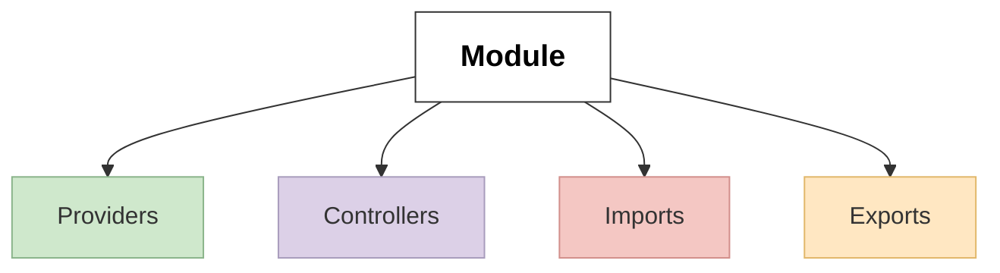
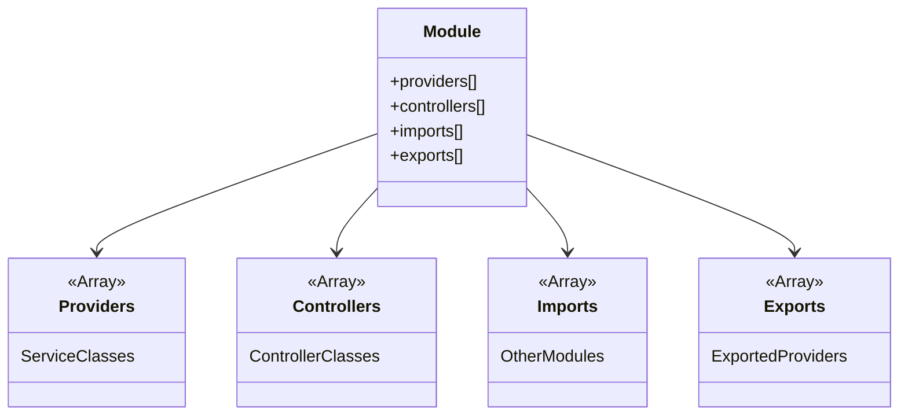
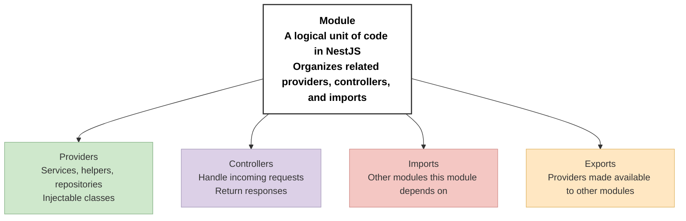
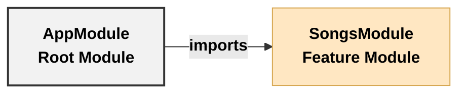
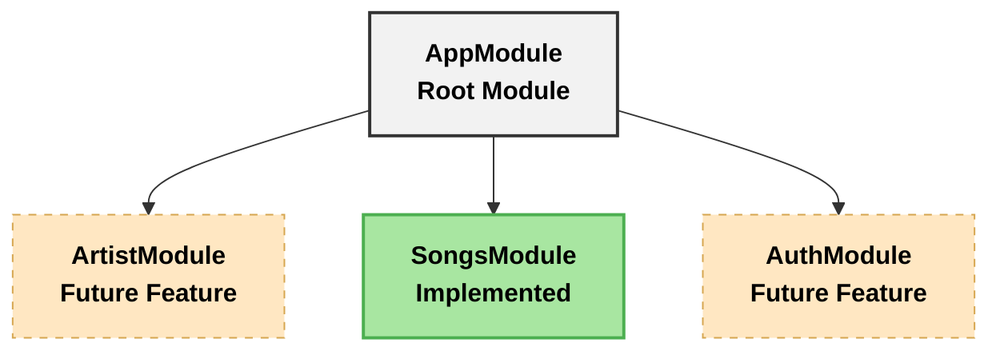
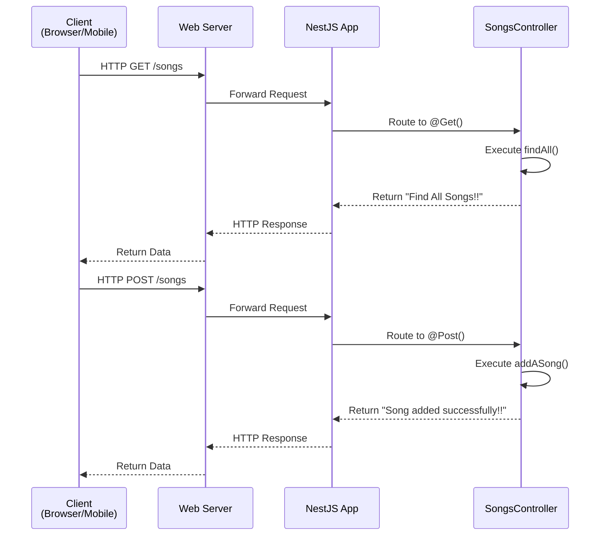

# CHAPTER 1: GETTING STARTED WITH NEST.JS

## WHAT IS NEST.JS

Managing a large-scale application can be tedious, especially when built without a well-planned structure and strict code organization strategy. Nest.js aids in this by enforcing modularity, thereby following the Single Responsibility Principle, a core tenet of solid software engineering.

Nest.js is a Node.js framework designed for crafting efficient, reliable, and scalable server-side applications. Built on top of Express and TypeScript, it adopts Node.js and Angular design patterns to provide a cohesive development experience. The framework's architecture embraces decorators and dependency injection, patterns borrowed from Angular, to facilitate better code organization and reusability.

## WHAT PROBLEM NEST.JS SOLVES

Maintaining consistency across a large codebase can be difficult; Nest.js addresses this by incorporating software engineering design patterns like SOLID and Dependency Injection. These design patterns contribute to a clean, maintainable, and scalable code architecture, adhering to Nest.js's principle of creating easily testable and loosely coupled code.

While unopinionated frameworks like Express offer multiple ways to structure your code, the freedom to choose can lead to decision paralysis, wasting time that could be better-spent building features. Nest.js sidesteps this issue by providing a modular approach right out of the box, allowing for flexible code organization while still enforcing a structured layout, aligning with its principle of modularity.

Sticking with an initial code organizational decision can be difficult, particularly as team members come and go. Nest.js's structured, modular approach helps maintain architectural integrity over time, making it easier for new developers to understand the codebase quickly.

Essentially, the issue Nest aims to solve is creating a robust architecture for backend applications. By providing a well-defined structure and integrating established design patterns, it answers a pressing question many developers have about organizing architecture for enterprise or large server-side applications.

## WHY NEST.JS WAS CREATED

The creator of Nest.js drew inspiration from Angular's design architecture to build a front-end application. Transferring this idea to the server side allowed for the broad utilization of a familiar architecture that incorporates Nest.js-specific elements like modules, dependency injection, providers, and custom decorators. This strategy embodies the Nest.js principle of modularity and extensibility, making it easier for developers who are already familiar with Angular to adopt Nest.js.

## WHY SHOULD YOU USE NEST.JS

If you aim to build server-side APIs utilizing TypeScript, Nest.js is the framework of choice. Nest.js employs strong typing and decorators, elements intrinsic to TypeScript, thus aligning closely with TypeScript principles. It also supports Dependency Injection out-of-the-box, encouraging a modular, scalable architecture.

Nest.js is particularly accessible for developers familiar with Angular, making the learning curve more manageable. Both frameworks share common programming paradigms and syntax, including the use of decorators and modules, enhancing code reusability and maintainability.

Nest.js enables you to construct various backend services, from RESTful APIs and GraphQL endpoints to MVC applications and WebSockets. The framework's flexibility accommodates multiple communication patterns, allowing for an extensive range of backend solutions.

Designed for building both large-scale monolithic and microservices applications, Nest.js offers scalability and modular architecture. It employs a "Module" system to organize code, which allows for straightforward unit testing and easier collaboration.

Nest.js provides native integrations with a host of external tools like Mongoose for MongoDB, TypeORM for various databases including Postgres, and many more. This extensibility allows developers to incorporate a multitude of functionalities without boilerplate code, making the framework more versatile.

## BENEFITS OF USING NEST.JS

- **Utilize Angular-style syntax for the backend**, a feature unique to Nest.js, that promotes consistency and reusability across the tech stack. This syntax allows developers familiar with Angular to seamlessly transition into backend development.
- **Leverage the detailed documentation with examples** that Nest.js provides. This not only accelerates the learning curve but also aligns with Nest.js's principle of being developer-friendly and easy to pick up.
- **Benefit from the framework's focus on good architecture and fast development**. Nest.js follows the modular architecture pattern, allowing for better separation of concerns and easier testing, which in turn speeds up the development process.
- **Strong TypeScript support** enables better code quality through static typing, catching errors at compile-time rather than runtime.
- **Modular architecture** promotes code reusability, maintainability, and testability.

## WHAT TYPE OF APPLICATION CAN YOU BUILD

- **Backend REST and GraphQL APIs**: Build scalable APIs using Nest.js, benefiting from its modular architecture that promotes code reusability and maintainability. The framework's built-in support for these query languages facilitates quick API development.
- **Microservices**: Construct microservices with Nest.js, taking advantage of its inherent support for multiple message transport layers. This aligns with the microservices architecture principle, which advocates for loosely coupled, independently deployable components.
- **Streaming Applications**: Build backend for streaming applications using Nest.js, as the framework supports asynchronous data handling through Observables. Nest.js makes it easier to work with real-time data streams, thanks to its integration with libraries like RxJS.
- **Real-time Applications**: Construct the backend of real-time applications in Nest.js, utilizing its WebSocket support for real-time two-way communication. This is essential for applications requiring instant data update and interaction, adhering to the principles of real-time system design.

## WHO IS USING NEST.JS IN PRODUCTION

- **Roche**: A multinational healthcare company operating under two divisions, pharmaceuticals and diagnostics. This American biotechnology company uses the Nest.js framework on its main website to reliably cater to its patients and to further expand its services.
- **Adidas**: The largest sportswear manufacturer in Europe and the second-largest in the world. Adidas is known for designing and manufacturing shoes, clothing, and accessories. Their global reach and popularity are why they decided to use the highly scalable Nest.js framework to build large-scale, efficient applications for their brand.
- **Decathlon**: A sporting goods retailer with over 1,500 stores in 57 countries. Decathlon chose Nest.js as the backend for their web application to help them scale and maintain their legacy codebase.

## CREATING A NESTJS PROJECT

Before creating the Nestjs project, make sure you have installed Node.js on your machine.

### Steps to create Nest.js project

1. Install the nest-cli globally:
```bash
npm install -g @nestjs/cli
```

2. Create a new project using Nest CLI:
```bash
nest new fundamentals
```

3. Start the project:
```bash
npm run start:dev
```

The project will be running at http://localhost:3000

## PROJECT DIRECTORY STRUCTURE

Nest.js designates the `src` folder as the location where you'll place your application's source code. This arrangement adheres to Nest.js's modular architecture, promoting better organization and separation of concerns within your application.

### Current Project Structure

```
src/
├── app.controller.spec.ts   # Unit tests for the controller
├── app.controller.ts         # Basic controller with a single route
├── app.module.ts             # Root module of the application
├── app.service.ts            # Basic service with business logic
├── main.ts                   # Entry point of the application
└── songs/
    ├── songs.controller.spec.ts  # Unit tests for songs controller
    ├── songs.controller.ts       # Songs controller with REST endpoints
    └── songs.module.ts           # Songs feature module
```

### Key Files Explained

#### main.ts - Application Entry Point

The `main.ts` file serves as the entry point for the application and employs the core function `NestFactory` to instantiate a Nest application. In Nest.js, `NestFactory` is pivotal for bootstrapping the application, setting up the dependency injection system, and initializing modules.

```typescript
import { NestFactory } from '@nestjs/core';
import { AppModule } from './app.module';

async function bootstrap() {
  const app = await NestFactory.create(AppModule);
  await app.listen(process.env.PORT ?? 3000);
}
bootstrap();
```

This follows the Nest.js principle of modular development and centralized configuration.

#### Other Key Files

- **app.controller.ts**: Basic controller file containing a single route. Controllers in Nest.js are responsible for request handling and response sending, acting as a gateway between client and server.
- **app.controller.spec.ts**: Contains unit tests for the controller, adhering to the Nest.js focus on test-driven development (TDD).
- **app.module.ts**: Root module of the application, which imports other modules and providers. Nest.js modules act as organizational units and follow the Single Responsibility Principle.
- **app.service.ts**: Basic service file with business logic. In Nest.js, services encapsulate business logic and can be injected into controllers, promoting Dependency Injection and the Separation of Concerns.

#### Configuration Files

- **nest-cli.json**: Utilized for Nest.js-specific configurations, allowing customization of compiler options, assets, and other settings.
- **.prettierrc**: Used for configuring Prettier, aiding in code formatting and style consistency within the Nest.js project.
- **tsconfig.json**: Configuration file for TypeScript, determining how the TypeScript compiler will behave. This aligns with Nest.js's use of TypeScript for strong typing and better code quality.

---

# CHAPTER 2: CREATING REST APIS

## WHAT IS A MODULE IN NEST.JS



A module serves as the foundational building block of a Nest.js application, adhering to the Nest.js principle of modularity for better code organization. Each Module encapsulates Providers, Controllers, Imports, and Exports, acting as a cohesive unit of related functionality.

### Module Components

- **Providers**: Classes that act as services, factories, or repositories. They encapsulate business logic and can be injected into controllers or other services.
- **Controllers**: Handle incoming HTTP requests and send responses back to the client, aligning with the Nest.js use of the controller pattern for request handling.
- **Imports**: An array that specifies the external modules needed for the current module, enabling code reusability and separation of concerns.
- **Exports**: Utilized to make services available to other modules, aligning with the Nest.js emphasis on encapsulation and modular design.

### NestJS @Module() Code Structure



### Detailed Module Diagram with Explanations



## THE ROOT MODULE

Your application will contain a Root Module, which is specific to the Nest.js framework. The Root Module (`AppModule`) serves as the entry point and is responsible for instantiating controllers, providers, and other core elements of the application. In Nest.js, this architecture follows the "Module Isolation" principle, ensuring that the application is organized into distinct functional or feature-based modules.

### Current AppModule Implementation

```typescript
@Module({
  imports: [SongsModule],
  controllers: [AppController],
  providers: [AppService],
})
export class AppModule {}
```

This implementation shows:
- **imports**: `[SongsModule]` - The Songs feature module is imported into the root module
- **controllers**: `[AppController]` - The root controller handling basic routes
- **providers**: `[AppService]` - The root service containing basic business logic

### Module Interconnection Diagram



## APPLICATION ARCHITECTURE: SPOTIFY BACKEND EXAMPLE

We are building the backend of a Spotify-like application. We can divide our application into modules to follow the modular architecture pattern.

### NestJS Spotify Backend – Module Structure



Divide your application's use cases into feature modules, such as the Artist Module, Songs Module, and Auth Module. In Nest.js, modules are a fundamental organizational unit that follow the Modularization principle, enabling better code reusability and separation of concerns. This approach streamlines development, as modules encapsulate related functionalities and can be developed or maintained independently.

### Creating a Module

Create a module using the Nest CLI:

```bash
nest g module songs
```

This command will:
1. Create a `songs` folder in the `src` directory
2. Generate a `songs.module.ts` file
3. Automatically add the `SongsModule` import to `AppModule`

---

## WHAT IS A NEST.JS CONTROLLER

Controllers in Nest.js are responsible for handling incoming requests and managing the logic to send responses back to the client. They act as the "C" in the MVC (Model-View-Controller) pattern that Nest.js leverages for application architecture.

### NestJS Controller Interaction Diagram



In the context of building the backend of a Spotify-like application, let's say you want to fetch all songs by an artist. The responsibility to handle this type of request lies with the `SongsController` and its `findAll()` method, which is designed to interact with underlying services to retrieve data and send it back to the client.

## CREATING THE SONGS CONTROLLER

### Generate Controller with Nest CLI

```bash
nest g controller songs
```

This command will:
1. Create a `songs.controller.ts` file inside the `songs` directory
2. Create a `songs.controller.spec.ts` file for testing
3. Automatically add the `SongsController` to `SongsModule`

### Implemented REST Endpoints

Our application implements the following RESTful endpoints for managing songs:

| HTTP Method | Endpoint | Description | Method Name |
|-------------|----------|-------------|-------------|
| `GET` | `/songs` | Get all songs | `findAll()` |
| `GET` | `/songs/:id` | Get a specific song by ID | `findASong()` |
| `POST` | `/songs` | Create a new song | `addASong()` |
| `PUT` | `/songs/:id` | Update a song by ID | `changeASong()` |
| `DELETE` | `/songs/:id` | Delete a song by ID | `removeASong()` |

### Current SongsController Implementation

```typescript
@Controller('songs')
export class SongsController {
  @Get()
  findAll() {
    return 'Find All Songs!!';
  }

  @Get(':id')
  findASong() {
    return 'Song Received!!';
  }

  @Post()
  addASong() {
    return 'Song added succesfully!!';
  }

  @Put(':id')
  changeASong() {
    return 'Song updated succesfully!!';
  }

  @Delete(':id')
  removeASong() {
    return 'Song removed succesfully!!';
  }
}
```

### Understanding Route Parameters

In Nest.js, you can specify dynamic parameters in your route by using a colon followed by the parameter name, like `@Get(':id')`. This follows the Nest.js principle of utilizing decorators to handle common HTTP tasks, streamlining the codebase and making it more readable.

The `:id` parameter in routes like `GET /songs/:id` allows the controller to handle requests for specific resources. For example:
- `GET /songs/1` - Retrieves song with ID 1
- `PUT /songs/5` - Updates song with ID 5
- `DELETE /songs/10` - Deletes song with ID 10

### HTTP Method Decorators

Nest.js provides decorators for all standard HTTP methods:
- `@Get()` - Handle GET requests (retrieve data)
- `@Post()` - Handle POST requests (create new data)
- `@Put()` - Handle PUT requests (update existing data)
- `@Patch()` - Handle PATCH requests (partial update)
- `@Delete()` - Handle DELETE requests (remove data)

### Testing the Endpoints

You can test these endpoints using:
- REST Client extension in VS Code
- Postman
- cURL commands
- Browser (for GET requests)

Example requests:
```http
### Get all songs
GET http://localhost:3000/songs

### Get a specific song
GET http://localhost:3000/songs/1

### Create a new song
POST http://localhost:3000/songs

### Update a song
PUT http://localhost:3000/songs/1

### Delete a song
DELETE http://localhost:3000/songs/1
```

---

## CURRENT PROJECT STATUS

### ✅ Implemented Features

1. **Root Module (AppModule)**
   - Configured with SongsModule import
   - AppController and AppService set up
   - Application bootstrapped in main.ts

2. **Songs Feature Module**
   - SongsModule created and registered
   - SongsController with all CRUD endpoints
   - Ready for service layer implementation

### 🚧 Next Steps

1. **Create SongsService**
   - Implement business logic for CRUD operations
   - Handle data validation and transformation
   - Prepare for database integration

2. **Add DTOs (Data Transfer Objects)**
   - Define CreateSongDto for POST requests
   - Define UpdateSongDto for PUT requests
   - Add validation decorators

3. **Implement Request Handling**
   - Extract route parameters using `@Param('id')`
   - Extract request body using `@Body()`
   - Add proper typing for responses

4. **Add Database Integration**
   - Set up database connection (TypeORM/Mongoose)
   - Create Song entity/schema
   - Implement data persistence

---

## NESTJS BEST PRACTICES

1. **Modular Architecture**: Organize code into feature modules for better maintainability
2. **Dependency Injection**: Use providers and services to separate business logic from controllers
3. **Single Responsibility**: Each module, controller, and service should have a single, well-defined purpose
4. **Type Safety**: Leverage TypeScript for compile-time type checking
5. **Testing**: Write unit tests for controllers, services, and integration tests for modules
6. **Validation**: Use DTOs with class-validator for input validation
7. **Error Handling**: Implement proper exception handling using built-in or custom exception filters

---

## RESOURCES

- [Official NestJS Documentation](https://docs.nestjs.com)
- [NestJS GitHub Repository](https://github.com/nestjs/nest)
- [TypeScript Documentation](https://www.typescriptlang.org/docs/)
- [Node.js Documentation](https://nodejs.org/docs/)

---

**Last Updated**: December 2, 2025 with 💖 by Minenhle Nkosi.
