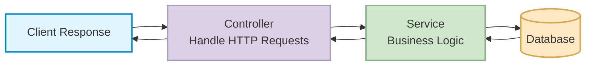

# CHAPTER 2: SERVICES IN NEST.JS


## WHAT IS A SERVICE IN NEST.JS

Services in Nest.js are providers, meaning you can inject them into modules and classes through dependency injection. In Nest.js, a service is not just a construct but a first-class citizen, managed by the framework's built-in Inversion of Control (IoC) container. Unlike in Express.js, where middleware or simple JavaScript functions often serve the same purpose but without formal dependency management, Nest.js services offer a structured way to write business logic, making the application more maintainable and testable.

### Service Architecture Diagram



A service in Nest.js is responsible for fetching data from the database and saving data back to the database, functioning as a liaison between the controller and the database. This concept aligns with Nest.js's adherence to the Single Responsibility Principle, separating the business logic from the controller layer, a stark contrast to Express.js where the roles are often less clearly delineated.

A service can be injected into a controller using Nest.js's built-in Dependency Injection system. You can also export the service from the current module, enabling its use in other parts of that specific module. This is another feature where Nest.js differentiates itself from frameworks like Express.js, offering native support for modularity and code reuse through its export system.

In this lesson, we'll focus on creating the song service, a specific component tailored to manage song-related data. Creating specialized services for different aspects of your application promotes better maintainability and is a cornerstone of Nest.js's modular architecture.

## CREATING THE SONGS SERVICE

### Service Basic Structure

A service is created using the `@Injectable()` decorator, which marks the class as a provider that can be managed by Nest.js's dependency injection system:

```typescript
@Injectable()
export class SongsService {}
```

### Generating a Service with Nest CLI

Create a new service using the Nest CLI:

```bash
nest g service songs
```

This command will:
1. Create a `songs.service.ts` file inside the `songs` folder
2. Create a `songs.service.spec.ts` file for testing
3. Automatically register the `SongsService` in the `SongsModule` providers array

### SongsModule After Service Registration

```typescript
@Module({
  imports: [],
  controllers: [SongsController],
  providers: [SongsService],
})
export class SongsModule {}
```

## IMPLEMENTING THE SONGS SERVICE

### Current SongsService Implementation

For now, we'll use a local array to store songs. Later, we'll switch to a PostgreSQL database.

```typescript
import { Injectable } from '@nestjs/common';

export interface Song {
  title: string;
  artist: string;
  [key: string]: any;
}

@Injectable()
export class SongsService {
  // Local DB - using an array as temporary storage
  private readonly songs: Song[] = [];

  create(song: Song): Song[] {
    // Save song to the database (currently array)
    this.songs.push(song);
    return this.songs;
  }

  findAll(): Song[] {
    // Fetch all songs from the database (currently array)
    return [...this.songs];
  }
}
```

The service includes:
- **Song Interface**: Defines the structure of a song object with `title` and `artist` properties
- **songs array**: Acts as temporary storage (will be replaced with database later)
- **create() method**: Adds a new song to the array and returns all songs
- **findAll() method**: Returns a copy of all songs in the array

## INJECTING THE SERVICE INTO THE CONTROLLER

### Dependency Injection in Action

Use the `SongsService` within the `SongsController`. In Nest.js, this demonstrates the Dependency Injection (DI) system, which is a fundamental principle of the framework for decoupling components. Unlike in Express.js, where middleware and route handling functions often mingle with business logic, Nest.js encourages a more structured, modular approach that aligns well with SOLID principles.

```typescript
import { Controller, Delete, Get, Post, Put } from '@nestjs/common';
import { SongsService, Song } from './songs.service';

@Controller('songs')
export class SongsController {
  // Dependency Injection: SongsService is injected into the constructor
  constructor(private songsService: SongsService) {}

  @Get()
  findAll(): Song[] {
    return this.songsService.findAll();
  }

  @Post()
  addASong(): Song[] {
    return this.songsService.create({
      title: 'Ulazi ',
      artist: 'Amaroto ',
    });
  }

  @Get(':id')
  findASong() {
    return 'Song Received!!';
  }

  @Put(':id')
  changeASong() {
    return 'Song updated succesfully!!';
  }

  @Delete(':id')
  removeASong() {
    return 'Song removed succesfully!!';
  }
}
```

### Understanding Dependency Injection

The `SongsController` is now dependent on `SongsService`. When you inject a service into the constructor using `private songsService: SongsService`, Nest.js's IoC container:
1. Creates an instance of `SongsService`
2. Injects it into the controller
3. Makes it available as `this.songsService` throughout the controller

This pattern promotes:
- **Loose coupling**: Controller doesn't need to know how to create the service
- **Testability**: Easy to mock the service in unit tests
- **Maintainability**: Business logic is separated from request handling

## TESTING THE IMPLEMENTATION

### Testing the POST Songs Route

Send a POST request to create a new song:

```http
POST http://localhost:3000/songs
```

This will:
1. Call the `addASong()` method in the controller
2. The controller calls `songsService.create()` with the song data
3. The service adds the song to the array
4. Returns all songs including the newly created one

**Response:**
```json
[
  {
    "title": "Ulazi ",
    "artist": "Amaroto "
  }
]
```

### Testing the GET Songs Route

Run the application and send a request:

```http
GET http://localhost:3000/songs
```

This API request will:
1. Call the `findAll()` method in the controller
2. The controller calls `songsService.findAll()`
3. The service returns all songs from the array

**Response (empty array if no songs):**
```json
[]
```

**Response (with songs):**
```json
[
  {
    "title": "Ulazi ",
    "artist": "Amaroto "
  }
]
```

Unlike in Express, where you would manually define the response code and body, Nest.js leverages decorators and dependency injection to streamline API response management. The framework automatically handles:
- JSON serialization
- HTTP status codes (200 for successful GET, 201 for successful POST)
- Response headers

## CURRENT PROJECT STATUS

### ✅ Implemented Features

1. **Root Module (AppModule)**
   - Configured with SongsModule import
   - AppController and AppService set up
   - Application bootstrapped in main.ts

2. **Songs Feature Module**
   - ✅ SongsModule created and registered
   - ✅ SongsController with all CRUD endpoints
   - ✅ SongsService created and injected
   - ✅ Business logic separated from controller
   - ✅ Working POST and GET endpoints with service integration

3. **Service Layer Implementation**
   - ✅ SongsService with create() and findAll() methods
   - ✅ Song interface defined for type safety
   - ✅ Local array as temporary database
   - ✅ Dependency injection configured

### 🚧 Next Steps

1. **Add DTOs (Data Transfer Objects)**
   - Define CreateSongDto for POST requests
   - Define UpdateSongDto for PUT requests
   - Add validation decorators using class-validator

2. **Implement Request Handling**
   - Extract route parameters using `@Param('id')`
   - Extract request body using `@Body()`
   - Implement findOne() method for GET /songs/:id
   - Implement update() method for PUT /songs/:id
   - Implement delete() method for DELETE /songs/:id

3. **Add Database Integration**
   - Set up database connection (TypeORM/Mongoose)
   - Create Song entity/schema
   - Replace local array with actual database operations
   - Implement proper error handling

---

**Last Updated**: December 9, 2025 with 💖 by Minenhle Nkosi.
